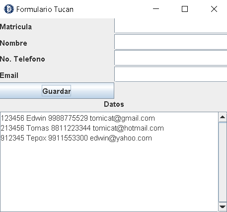

# FORMULARIO TECNM 📃

Aquí veras un simple Formulario en el cual sirve para capturar algunos datos basicos de estudiantes del ITC (_Instituto Tecnologico de Cancún_)

## Caracteristicas 🔎

Por ahora no se contiene nada avanzado, por ahora solo utilizo conceptos basicos, y probablemente le agrege algunas ideas, no estaria mal _¿Cierto?...._

## Ideas 💡

- Conectarse a una base de datos
- Validar campos

## Screenshots

## Authors 🙍‍♂️

- [@TomiCat](https://www.github.com/TomEd01)

